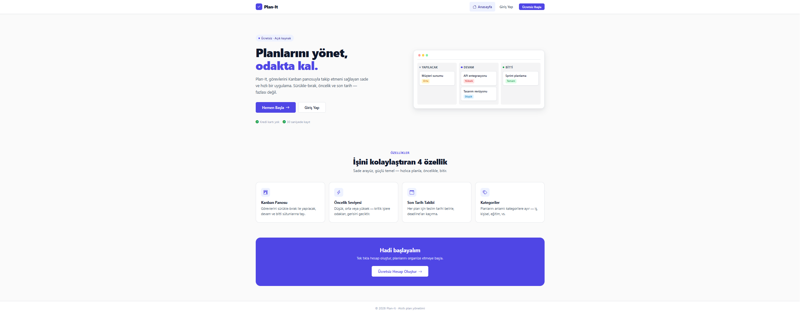
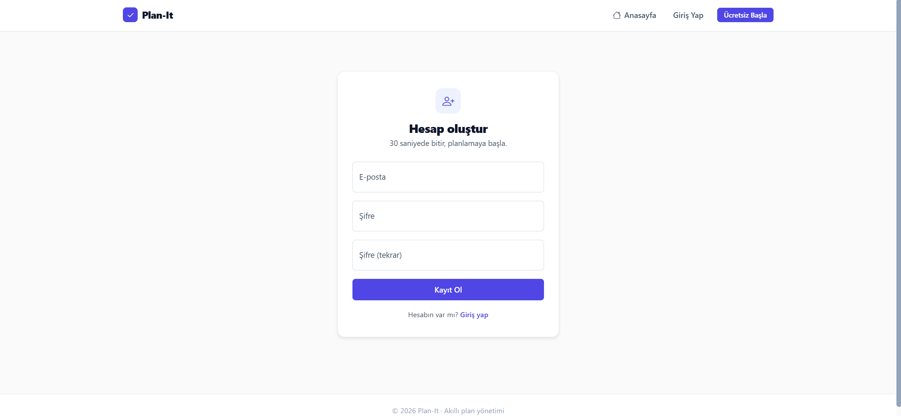
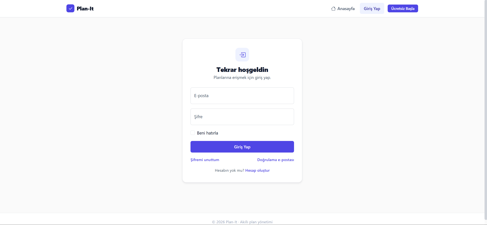
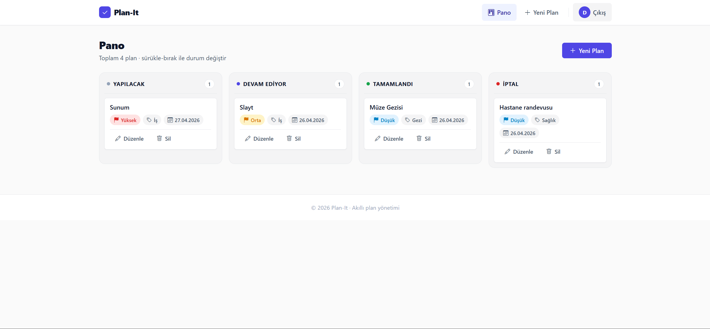

<div align="center">

# Plan-It

**A clean, fast task management app built on a Kanban board.**

[](https://dotnet.microsoft.com/)
[](https://docs.microsoft.com/en-us/ef/core/)
[](https://www.sqlite.org/)
[](https://getbootstrap.com/)

</div>

---

## Screenshots

> **Home**


> **Register**
> 

> **Login**


> **Kanban**

---

## Features

| | Feature | Details |
|---|---|---|
| 🗂 | **Kanban board** | Drag-and-drop across four columns: *To Do / In Progress / Done / Cancelled* |
| 🔴 | **Priority levels** | Low, Medium, High — color-coded at a glance |
| 📅 | **Due date tracking** | Overdue tasks are automatically highlighted |
| 🏷 | **Categories** | Group plans by category; categories are managed by admins |
| 🛡 | **Admin panel** | User list, role management, user deletion, and system stats |
| 🔐 | **Identity auth** | Registration, login, and account lockout via ASP.NET Identity |

---

## Tech Stack

- **ASP.NET Core 8** — MVC
- **Entity Framework Core** — data access
- **SQLite** — zero-config local database (`./Plan_It.db`)
- **ASP.NET Identity** — authentication & authorization
- **Bootstrap 5** — UI

---

## Architecture

```
Controllers/     HTTP endpoints
Services/        Business logic (IPlanService, ICategoryService)
Repository/      EF Core data access
Models/          Domain + ViewModel classes
Areas/Identity/  ASP.NET Identity scaffold (Login / Register / Logout)
wwwroot/css/     Design system (site, landing, kanban, auth)
```

Data flows through **Repository → Service → Controller**; each layer owns its own responsibility. Every service method enforces `userId` — a user can never access another user's plans.

---

## Getting Started

### Prerequisites

- [.NET 8 SDK](https://dotnet.microsoft.com/download)
- EF Core CLI: `dotnet tool install --global dotnet-ef`

### Run locally

```bash
git clone <repo-url>
cd Plan-It

# Create the database (SQLite, ./Plan_It.db)
dotnet ef database update

# Set the admin password via user-secrets (keeps it out of source control)
dotnet user-secrets init
dotnet user-secrets set "AdminUser:Password" "Your-Secret-Password!"

# Start the app
dotnet run
```

Default admin account: `admin@example.com` — password is whatever you set above.

---

## Configuration

All sensitive values in `appsettings.json` should be overridden with `dotnet user-secrets` (local dev) or environment variables (production). **Never commit secrets to source control.**

---

## Security

- **CSRF protection** — `[ValidateAntiForgeryToken]` on every POST endpoint
- **Security headers** — Content Security Policy, X-Frame-Options, X-Content-Type-Options
- **Brute-force protection** — account locked for 15 minutes after 5 failed attempts
- **Secure cookies** — HttpOnly, SameSite=Lax, 8-hour sliding expiration
- **Password policy** — minimum 8 characters, requires uppercase, lowercase, and digit

---
